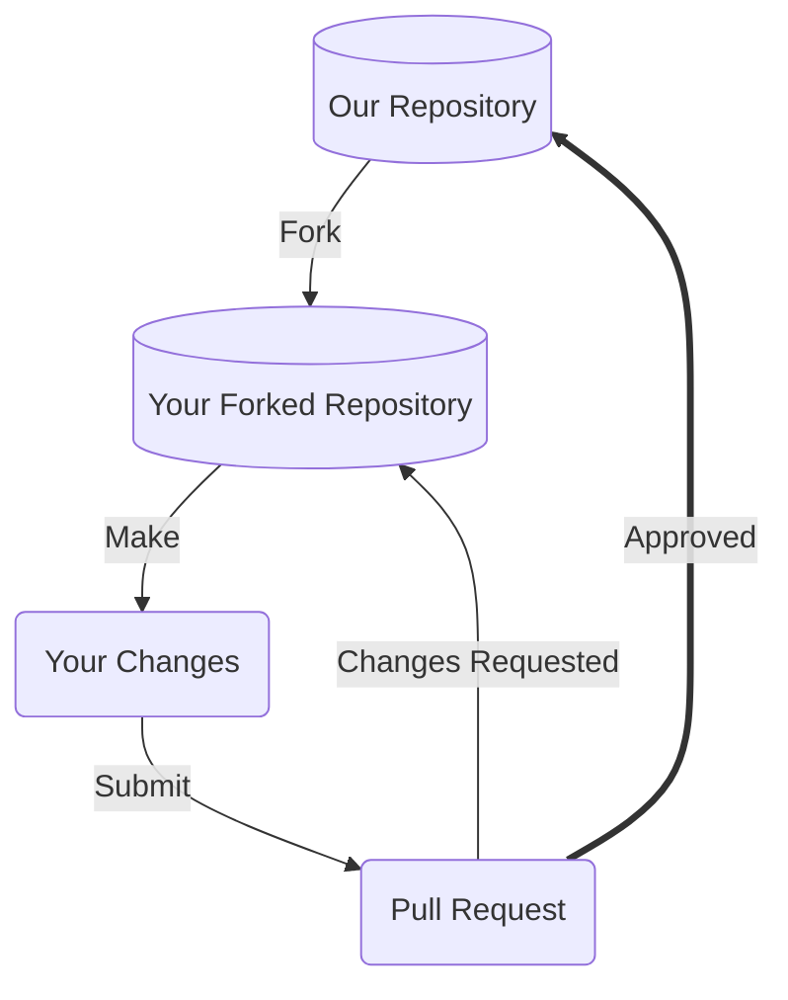

# Contributing to MMGIS

Thanks for taking the time to consider contributing! We very much appreciate your time and effort. This document outlines the many ways you can contribute to our project, and provides detailed guidance on best practices. We look forward to your help!

## Introduction

MMGIS (Multi-Mission Geographical Information System) is a highly-configurable, cross-mission web-based and open-source mapping application. It's been used on MSL, InSight, Mars 2020, EMIT, MAIA, Lunar VIPER, ... to name a few. And we would much appreciate your help! Here are the basics on contributing:

- Anyone can contribute!
- You can contribute at any time
- You can contribute in any way (code, documentation, discussion topics, issue ticket discussions, etc.)

Our team adapts to our stakeholders' processes and schedules and develops any and **all feature requests to be as mission-agnostic and reusable as possible.**

Since we're an open source project, we also accept and encourage ad-hoc contributions at any time - just note it may take some time to review / decide whether to incorporate.

### Quickstart to Contributing

1. See our open list of [issue tickets](https://github.com/NASA-AMMOS/MMGIS/issues) and pick a ticket(s) you're interested in, or write your own!
1. Fork the `development` branch
1. Make a feature branch
1. Make your changes
1. Include the issue number as `#{issue_number}` in both your commit messages and PR title.
1. Submit a PR

Feel free to reach out and ask questions!

#### Contributing Any Other Time

See our [Ways to Contribute](#ways-to-contribute) section.

## Prerequisites

Before you begin contributing to our project, it'll be a good idea to ensure you've satisfied the below pre-requisites.

### License

Our project has our licensing terms, including rules governing redistribution, documented in our [LICENSE](LICENSE) file. Please take a look at that file and ensure you understand the terms. This will impact how we, or others, use your contributions.

### Code of Conduct

Our Code of Conduct helps facilitate a positive interaction environment for everyone involved with the team, and provides guidance on what to do if you experience problematic behavior. Read more in our [CODE_OF_CONDUCT.md](CODE_OF_CONDUCT.md), and make sure you agree to its terms.

### Developer Environment

For patch contributions, see our Developer Documentation (TBD) for more details on how to set up your local environment, to best contribute to our project.

At a minimum however to submit patches (if using Git), you'll want to ensure you have:

1. An account on the Version Control System our project uses (i.e. GitHub).
2. The Version Control System client (i.e. Git) installed on your local machine.
3. The ability to edit, build, and test our project on your local machine. Again, see our `README.md` or detailed developer guide for more details

### Communication Channels

Before contributing changes to our project, it's a great idea to be familiar with our communication channels and to socialize your potential contributions to get feedback early. This will help give you context for your contributions, no matter their form.

Our communication channels are:

- [Issue tracking system](https://github.com/NASA-AMMOS/MMGIS/issues) - a regularly monitored area to report issues with our software or propose changes
- [Discussion board](https://github.com/NASA-AMMOS/MMGIS/discussions) - an permanently archived place to hold conversations related to our project, and to propose as well as show+tell topics to the contributor team. This resource can be searched for old discussions.

## Our Development Process

Our project integrates contributions from many people, and so we'd like to outline a process you can use to visualize how your contributions may be integrated if you provide something.



### Fork our Repository

Forking our repository, as opposed to directly committing to a branch is the preferred way to propose changes.

See [this GitHub guide](https://docs.github.com/en/get-started/quickstart/fork-a-repo) on forking for information specific to GitHub.com

#### Find or File an Issue

Make sure people are aware you're working on a patch! Check out our [issue tracking system](https://github.com/NASA-AMMOS/MMGIS/issues) and find an open issue you'd like to work against, or alternatively file a new issue and mention you're working on a patch.

#### Choose the Right Branch to Fork

Our project typically has the following branches available, make sure to fork either the default branch or a branch someone else already tagged with a particular issue ticket you're working with.

- `master` - default branch, and contains the latest MMGIS release
- `development` - active development area for MMGIS deliverables, and typically ahead of `master`. **This is the branch you want to fork from.**

_Note: Some customers prefer the latest features of the `development` branch at the expense of stability. All changes pulled into `development` should be considered operational with a reasonable degree of confidence._

### Make your Modifications

Within your local development environment, this is the stage at which you'll propose your changes, and commit those changes back to version control. See the [README.md](README.md) or development guide for more specifics on what you'll need as prerequisites to setup your local development environment.

#### Commit Messages

Commit messages to version control should reference a ticket in their Issue Number - title / summary line:

```
#248 - Show an example commit message title
```

This makes sure that tickets are updated on GitHub with references to commits that are related to them.

Commit should always be atomic. Keep solutions isolated whenever possible. Filler commits such as "clean up white space" or "fix typo" should be merged together before making a pull request, and significant sub-feature branches should be [rebased](https://www.youtube.com/results?search_query=git+rebase) to preserve commit history. Please ensure your commit history is clean and meaningful!

### Submit a Pull Request

Pull requests are the core way our project will receive your patch contributions. Navigate to your branch on your own fork within the version control system, and submit a pull request or submit the patch text to our project.

Please make sure to provide a meaningful text description to your pull requests, whenever submitted. Our pull-request template will be auto-generated for you when you create your pull-request. See the template [here](.github/PULL_REQUEST_TEMPLATE.md).

**Working on your first Pull Request?** See guide: [How to Contribute to an Open Source Project on GitHub](https://kcd.im/pull-request)

### Reviewing your Pull Request

Reviewing pull-requests, or any kinds of proposed patch changes, is an art. That being said, we follow the following best practices:

- **Intent** - is the purpose of your pull-request clearly stated?
- **Solution** - is your pull-request doing what you want it to?
- **Correctness** - is your pull-request doing what you want it to _correctly_?
- **Small Patches** - is your patch of a level of complexity and brevity that it can actually be reviewed by a human being? Or is does it involve too much content for one pull request?
- **Coding best practices** - are you following best practices in the coding / contribution language being used?
- **Readability** - is your patch readable, and ultimately maintainable, by others?
- **Reproducibility** - is your patch reproducible by others?
- **Tests** - do you have or have conducted meaningful tests?

## Ways to Contribute

### ⚠️ Issue Tickets

> _Do you like to talk about new features, changes, requests?_

Issue tickets are a very simple way to get involved in our project. It also helps new contributors get an understanding of the project more comprehensively. This is a great place to get started with the project if you're not sure where to start.

See our list of issues at: https://github.com/NASA-AMMOS/MMGIS/issues

#### Cleaning up Duplicate Issues

Often we receive duplicate issues that can confuse project members on _which_ issue ticket to hold conversations upon.

Here's how you can help:

1. Scan the list of _open_ issue tickets for duplicate titles, or internal wording
2. If you find duplicates, copy / paste the below message on the conversation thread of the issue ticket _that has less participants_ involved

```
This is a duplicate issue. Please migrate conversations over to [issue-XYZ](hyperlink to issue)
```

#### Good First Issues

Issue tickets can vary in complexity, and issues labeled with `good first issue` labels are often a great way to get started with the project as a newcomer.

Take a look at our [issue tracking system](https://github.com/NASA-AMMOS/MMGIS/issues), and filter by `good first issue` for issues that are low-complexity, and that will help you get familiar with our issue tracking and patch submission process.

#### Suggesting New Issue Labels

Labels within our [issue tracking system](https://github.com/NASA-AMMOS/MMGIS/issues) are a great way to quickly sort through tickets. The project may not yet have labels to cover the full variety of issue tickets. Take a look through our list of issues, and if you notice a set of issue tickets that seem similar but are not categorized with an existing label, go ahead submit a request within one of the issues you've looked at with the following text:

```
I've noticed several other issues that are of the same category as this issue. Shall we make a new label for these types of issues?
```

#### Submitting Bug Issues

Resolving bugs is a priority for our project. We welcome bug reports. However, please make sure to do the following prior to submitting a bug report:

- **Check for duplicates** - there may be a bug report already describing your issue, so check the [issue tracking system](https://github.com/NASA-AMMOS/MMGIS/issues) first.

Here's some guidance on submitting a bug issue:

1. Navigate to our [issue tracking system](https://github.com/NASA-AMMOS/MMGIS/issues) and file a new issue
2. Select a bug template (if available) for your issue
   1. Fill out the template fields to the best of your ability, including output snippets or screenshots where applicable
3. Follow the general guidelines below for extra information about your bug
   1. Include a code snippet if you have it showcasing the bug
   2. Provide reproducible steps of how to recreate the bug
   3. If the bug triggers an exception or error message, include the _full message_ or _stacktrace_
   4. Provide information about your operating system and the version of our project you're using

#### Submitting Security Vulnerability Issues

Security vulnerabilities should **not** be filed to the regular issue tracking system.

Report your security vulnerabilities to (see contact links): https://github.com/tariqksoliman

Please be sure to:

- Indicate the severity of the vulnerability
- Provide any workarounds, if you know them
- Provide return-contact information to follow-up with you if needed

#### Reviewing Pull Requests

Reviewing others' contributions is a great way to learn about best practices in both contributions as well as software.

Take a look at our [pull requests tracking system](https://github.com/NASA-AMMOS/MMGIS/pulls), and try the following options for providing a review:

1. Read the code / patch associated with the pull-request, and take note of any coding, bug, or documentation issues if found
2. Try to recreate the pull-request patch on your local machine, and report if it has issues with your system in particular
3. Scan over suggested feedback from other contributors, and provide feedback if necessary

### 📖 Documentation

Documentation is the core way our users and contributors learn about the project. We place a high value on the quality, thoroughness, and readability of our documentation. Writing or editing documentation is an excellent way to contribute to our project without performing active coding.

⚠️ It's **highly** advised that you take a look at our [issue-tracking system](https://github.com/NASA-AMMOS/MMGIS/issues) before considering any documentation contributions. Here's some guidelines:

1. Check if any duplicate issues exist that cover your documentation contribution idea / task, and add comments to those tickets with your thoughts.
2. If no duplicates exist, create a new issue ticket and get a conversation started before making documentation changes.

Some guidelines for documentation best practices (summarized from Google's [excellent documentation guide](https://google.github.io/styleguide/docguide/best_practices.html)):

- **Minimum viable docs** - don't do less documentation than your readers need, but also don't do more
- **Changed best practice use cases = changed docs** - if your best practice use cases have changed, remember to update your documentation
- **Delete old docs** - continually clean your documentation tree, and remove outdated docs regularly

#### Documentation Organization

The overall structure of our project documentation is as follows:

- Source-controlled documentation
  - [README.md](README.md) - top-level information about how to run, build, and contribute to the project
  - [CODE_OF_CONDUCT.md](CODE_OF_CONDUCT.md) - best practices and guidance on how to work well with other people in the project, and suggestions on dealing with interpersonal issues
  - [CONTRIBUTING.md](CONTRIBUTING.md) - guidance on contributing to the project
- Discussion Boards
  - [Discussion Board](https://github.com/NASA-AMMOS/MMGIS/discussions) - discussions related to MMGIS

For directions on contributing to our source-controlled documentation:

1. Ensure you have development [prerequisites](#prerequisites) cleared.
2. Have your [development environment](#developer-environment) set up properly.
3. Go through our [development process](#our-development-process), including proposing changes to our project.

#### MMGIS Configuration Documentation

Our MMGIS configuration documentation for developers and site administrators is located at https://nasa-ammos.github.io/MMGIS/

This documentation site is hosted by GitHub through the `/docs` folder in the `development` branch. The site is a static site built with Jeykll.

#### Writing Style

To ensure documentation is readable and consistent by newcomers and experts alike, here are some suggestions on writing style for English:

- Use gender neutral pronouns (they/their/them) instead of he/she/his/her
- Avoid qualifiers that minimize the difficulty of a task at hand, e.g. avoid words like "easily", "simply", "just", "merely", "straightforward", etc. Readers' expertise may not match your own, and qualifying complexity may deter some readers if the task does not match their level of experience. That being said, if a particular task is difficult or complex, do mention that.

#### Common Wording

Below are some commonly used words you'll want to leverage in your documentation contributions:

- **GitHub** - one word, and capitalization of the 'G' and the 'H'
- **MMGIS** - one word, all capitalized

#### Inline Code Documentation

For language-specific guidance on code documentation, including style guides, see [Google's list of language style guides](https://google.github.io/styleguide/) for a variety of languages.

Additionally, take a look at Google's recommendations on [inline code documentation](https://google.github.io/styleguide/docguide/best_practices.html#documentation-is-the-story-of-your-code) for best practices.

#### Media

Media, such as such as images, videos, sound files, etc., are an excellent way to explain documentation to a wider audience more easily. Include media in your contributions as often as possible.

When including media into our version-control system, it is recommended to use formats such as:

- Diagrams: [Mermaid](https://mermaid-js.github.io/mermaid/#/) format
- Images: JPEG format
- Videos: H264 MPEG format
- Sounds: MP3 format

### ❓ Questions

Answering questions is an excellent way to learn more about our project, as well as get better known in our project community.

Here are just a few ways you can help answer questions for our project:

- Answer open questions in our [discussion forum](https://github.com/NASA-AMMOS/MMGIS/discussions/categories/q-a)
- Answer open questions mentioned in our [issue tracking system](https://github.com/NASA-AMMOS/MMGIS/issues)

When answering questions, keep the following in mind:

- Be polite and friendly. See our [Code of Conduct](CODE_OF_CONDUCT.md) recommendations as you interact with others in the team.
- Repeat the specific question you are answering, followed by your suggestion.
- If suggesting code, repeat the line of code that needs to be altered, followed by your alteration
- Include any post-steps or checks to verify your answer can be reproduced

### 🎨 Design

Design files can help to guide new features and new areas of expansion for our project. We welcome these kinds of contributions.

Here are just a few ways you can help provide design recommendations for our project:

- Create visual mockups or diagrams to increase usability of our project applications. This can apply to user interfaces, documentation structuring, or even code architecture diagrams.
- Conduct user research to understand user needs better. Save your findings within spreadsheets that the project team / contributors can review.
- Create art, such as logos or icons, to support the user experience for the project

Each of the above can be contributed directly to repository code, and you should use our [development process](#our-development-process) to contribute your additions.

### 🎟️ Meetups

A great way to contribute towards our project goals is to socialize and encourage people to meet and learn more about each other. Consider ideas like:

- Propose workshops or meetups regarding some topic within our project
- Help point project contributors and community members to conferences and publications where they may socialize their unique innovations
- Schedule in-person or virtual happy-hours to help create a more social atmosphere within the project community

For the above ideas, use our [communication channels](#communication-channels) to propose get-togethers.

---

# Larger Coding Contributions

MMGIS supports pluginable backend APIs and frontend Tools.

## Developing A New Tool

### Setup

New tools are automatically found and included on start.

1. Go to `src/essence/Tools`

   1. Create a new directory here with the name of your new tool
   1. Copy and paste `New Tool Template.js` into your new directory
   1. Rename the pasted file to `[Your Tool's Name]Tool.js`
   1. Add a `config.json` file so that MMGIS can find it. Do look at the existing tools' `config.json` but here's a template:

   ```javascript
   {
        "defaultIcon": "a material design icon https://pictogrammers.com/library/mdi/ identifier",
        "description": "A quick description of the tool's capabilities.",
        "descriptionFull": {
            "title": "A longer description of the tool's capabilities.",
            "example": {
                "A example object of the configuration variables the tool accepts": "value"
            }
        },
        "hasVars": true,
        "name": "{toolName}",
        "toolbarPriority": 3,
        "paths": {
            "{toolName}Tool": "essence/Tools/{toolName}/{toolName}Tool"
        },
        "expandable": false
    }

   ```

1. Restart the server with `npm start`

1. Use the `/configure` page to enable the tool in your development environment

### Developing

#### Overview

Ideally all the code for a tool will be in its `[Tool's Name]Tool.js` and built off of the `New Tool Template.js`.

- All tools must return an object with `make` and `destroy` functions.
  - `make` is called when the user clicks on the tool's icon while `destroy` is called when the user clicks on any other tool's icon.
- Tools should work independently of one another.
- Tools should only change the `#tools` div or something in the viewer, map and/or globe.
- Use `width` or `height` entries to set the tool div's dimensions.

### Notes

- There are private repos with pluginable tools that are not visible to the public. If you would like to include your own private tool, place it in a `/src/essence/MMGIS-Private-Tools` directory.

## Developing A New Backend

### Setup

New backends are automatically found and included on start.

1. Go to `API/Backend`
   1. Create a new directory here with the name of your new backend
   1. Copy and paste `setupTemplate.js` into your new directory
   1. Rename the pasted file to `setup.js`
   1. Edit `setup.js` based on the development guide below
1. Restart the server with `npm start`

### Developing

#### Overview

All the code for a backend must stay in its `API/Backend/[name]` directory.

- Backends should work independently of one another.
- Use the existing backends as a reference point.

#### Template Walkthrough

```javascript
const router = require("./routes/your_router");
```

Write scripts within you backend directory and import them. Most backends follow the directory structure:

- API/Backend/[name]
  - models/
  - routes/
  - setup.js

```
let setup = {
  //Once the app initializes
  onceInit: s => {},
  //Once the server starts
  onceStarted: s => {},
  //Once all tables sync
  onceSynced: s => {},
  envs: [{ name: "ENV_VAR", description: "", required: false, private: false }]
};
```

onceInit() is called immediately on `npm start`
onceStarted() is called once the http server starts up
onceSynced() is called once all table are created/has their existence verified.

The s parameter is an object containing the app and middleware. A common form to attach an API within a `setup.js` is to fill onceInit() with:

```javascript
onceInit: (s) => {
  s.app.use(
    "/API/example",
    s.ensureUser(),
    s.checkHeadersCodeInjection,
    s.setContentType,
    s.stopGuests,
    importedRouter
  );
};
```

`envs` help document which environment values the backend uses and logs errors if required environment variables aren't set. Variables that end with `_HOST` are for URLs and upon start up they'll be pinged and there status will be logged.

Please refer to the existing backend directories for further examples.

---

_CONTRIBUTING.md template by [NASA SLIM](https://github.com/nasa-ammos/slim)_
